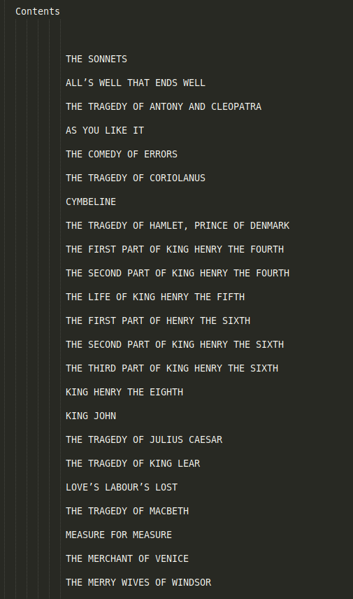
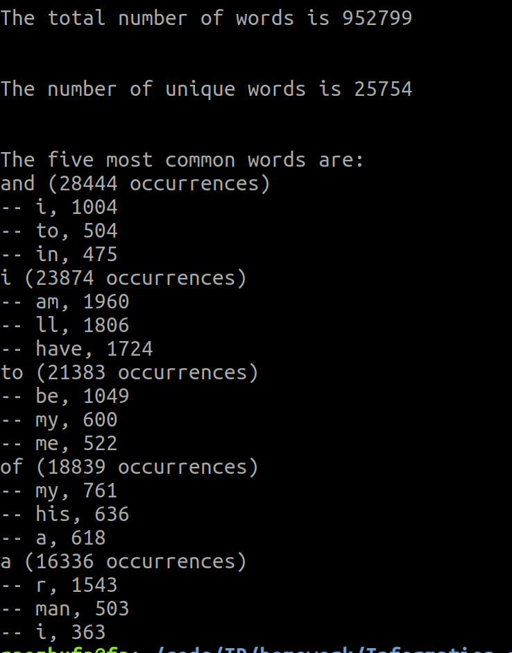
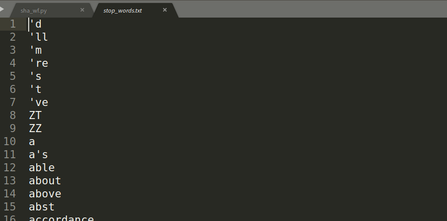

home work of IR

topic ：WF 、stop word、Jump table、Inverted index、Two-word inverted index list、Inverted index list with location information
demand:

- [x]  a . 到网上下载《莎士比亚全集》（中、英版均可，中英合集也行），提取出其中所有的词项
- [ ]  b. 到网上下载《停用词表》，处理词项中的停用词
- [ ] c. 构建词项的常规倒排索引列表（将莎士比亚全集中的每个剧本作为文档）
- [ ] d. 构建带跳表指针的词项倒排索引列表
- [ ] e . 构建词项的双词倒排索引列表
- [ ] f. 构建词项的带位置信息的倒排索引列表

作业说明：

​	完成情况：

   a: 英文版莎士比亚全集目录

​	程序统计出来的词项(未加入停用此表)：处理对象为莎士比亚全集（所有文档合为一个文档）

​					

**b**、停用词表：共880项

